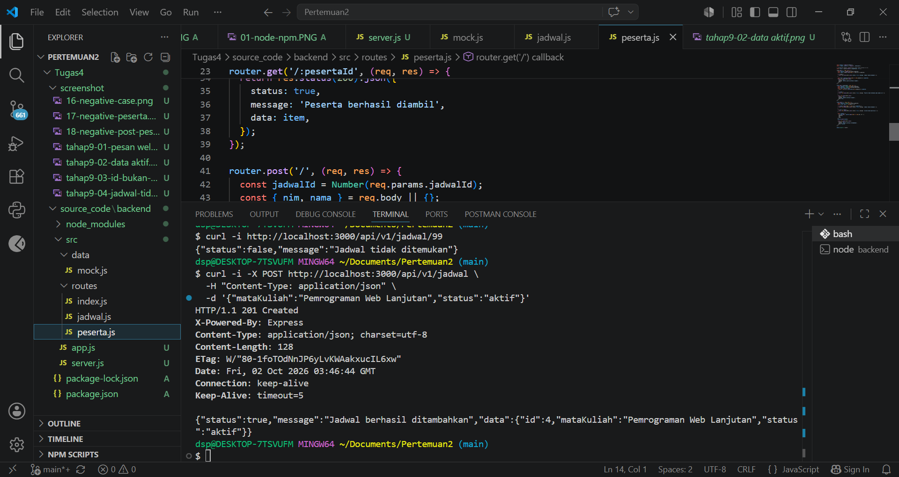
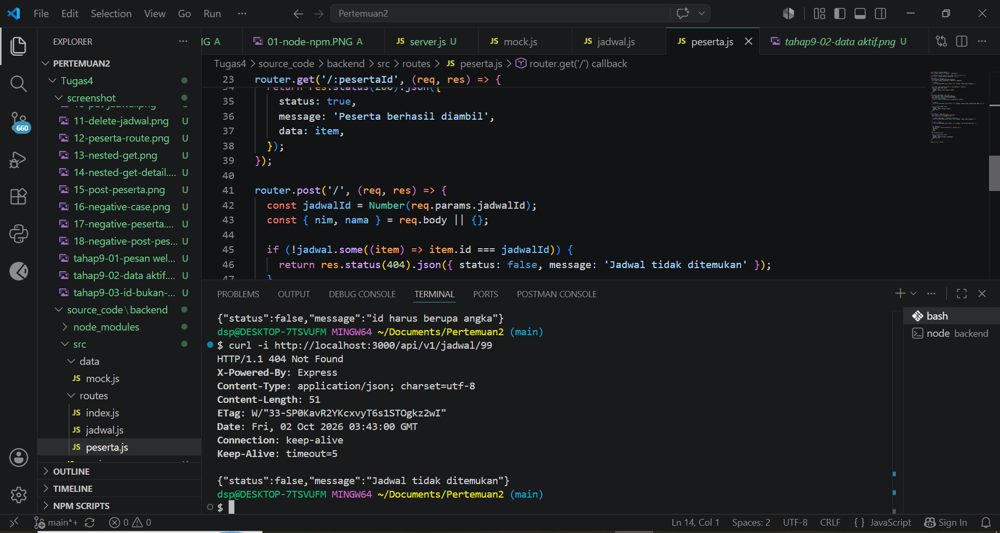
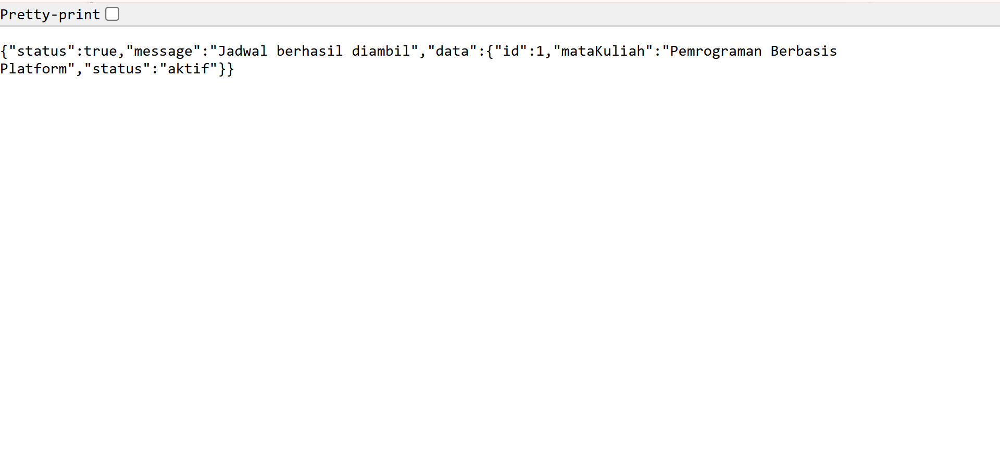
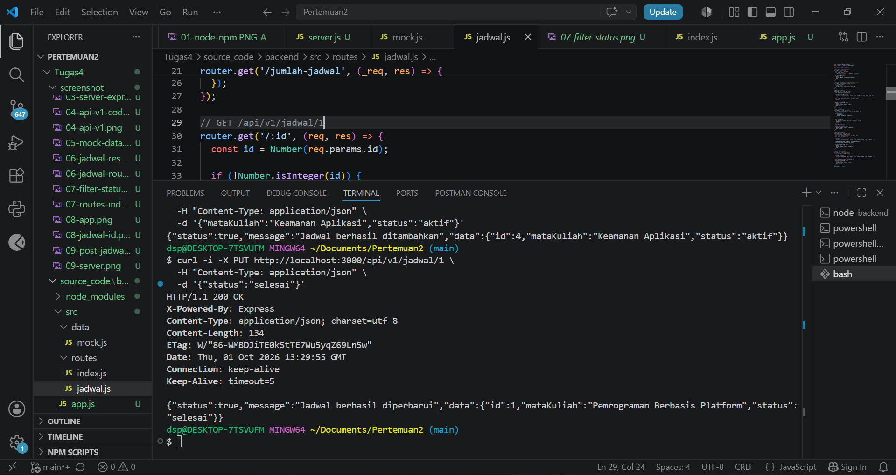
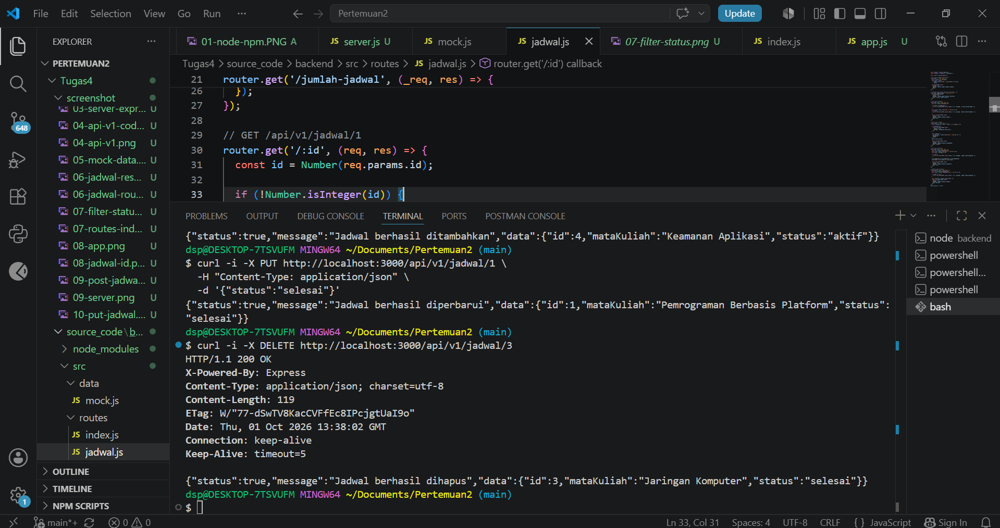
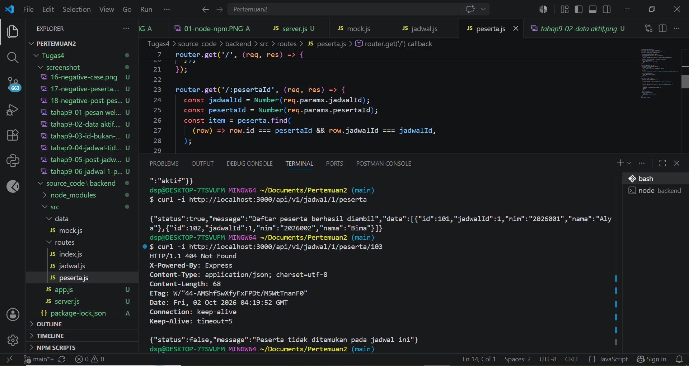
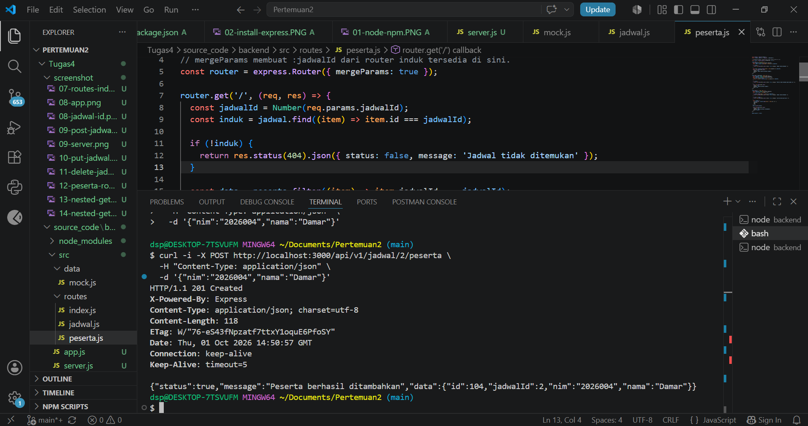

# Dokumentasi Routing API
## 1. GET /api/v1

**Method:** GET
**URL:** `http://localhost:3000/api/v1`
**Input:** Tidak ada
**Status sukses:** 200 OK
**Status gagal:** Tidak ada
**Contoh response:**

```json
{
  "status": true,
  "message": "Welcome to API v1",
  "data": null
}
```
### Tangkapan layar


## 2. GET /api/v1/jadwal?status=aktif
**Method:** GET
**URL:** `http://localhost:3000/api/v1/jadwal?status=aktif`
**Input:** Query `status=aktif`
**Status sukses:** 200 OK
**Status gagal:** Tidak ada

**Contoh response:**
```json
{
  "status": true,
  "message": "Daftar jadwal berhasil diambil",
  "data": [
    {
      "id": 1,
      "mataKuliah": "Pemrograman Berbasis Platform",
      "status": "aktif"
    },
    {
      "id": 2,
      "mataKuliah": "Basis Data",
      "status": "aktif"
    }
  ]
}
```
### Tangkapan layar


## 3. POST /api/v1/jadwal
**Method:** POST
**URL:** `http://localhost:3000/api/v1/jadwal`
**Input:** Body JSON
**Status sukses:** 201 Created
**Status gagal:** 400 Bad Request jika `mataKuliah` tidak diisi
**Contoh request:**

```json
{
  "mataKuliah": "Pemrograman Web Lanjutan",
  "status": "aktif"
}
```

**Contoh response:**
```json
{
  "status": true,
  "message": "Jadwal berhasil ditambahkan",
  "data": {
    "id": 4,
    "mataKuliah": "Pemrograman Web Lanjutan",
    "status": "aktif"
  }
}
```
### Tangkapan layar



## 4. GET /api/v1/jadwal/:jadwalId/peserta
**Method:** GET
**URL:** `http://localhost:3000/api/v1/jadwal/1/peserta`
**Input:** Parameter `jadwalId`
**Status sukses:** 200 OK
**Status gagal:** 404 Not Found jika jadwal tidak ditemukan

**Contoh response:**
```json
{
  "status": true,
  "message": "Daftar peserta berhasil diambil",
  "data": [
    {
      "id": 101,
      "jadwalId": 1,
      "nim": "2026001",
      "nama": "Alya"
    },
    {
      "id": 102,
      "jadwalId": 1,
      "nim": "2026002",
      "nama": "Bima"
    }
  ]
}
```
### Tangkapan layar


## 5. GET /api/v1/jadwal/99
**Method:** GET
**URL:** `http://localhost:3000/api/v1/jadwal/99`
**Input:** Parameter `id`
**Status sukses:** 200 OK jika jadwal ditemukan
**Status gagal:** 404 Not Found jika jadwal tidak ditemukan

**Contoh response gagal:**
```json
{
  "status": false,
  "message": "Jadwal tidak ditemukan"
}
```
### Tangkapan layar



## 6. GET /api/v1/jadwal/:id
**Method:** GET
**URL:** `http://localhost:3000/api/v1/jadwal/1`
**Input:** Parameter `id`
**Status sukses:** 200 OK
**Status gagal:** 400 Bad Request jika id bukan angka, atau 404 Not Found jika jadwal tidak ditemukan

**Contoh response:**
```json
{
  "status": true,
  "message": "Jadwal berhasil diambil",
  "data": {
    "id": 1,
    "mataKuliah": "Pemrograman Berbasis Platform",
    "status": "aktif"
  }
}
```
### Tangkapan layar



## 7. PUT /api/v1/jadwal/:id
**Method:** PUT
**URL:** `http://localhost:3000/api/v1/jadwal/1`
**Input:** Parameter `id` dan body JSON
**Status sukses:** 200 OK
**Status gagal:** 404 Not Found jika jadwal tidak ditemukan

**Contoh request:**
```json
{
  "status": "selesai"
}
```

**Contoh response:**
```json
{
  "status": true,
  "message": "Jadwal berhasil diperbarui",
  "data": {
    "id": 1,
    "mataKuliah": "Pemrograman Berbasis Platform",
    "status": "selesai"
  }
}
```

### Tangkapan layar



## 8. DELETE /api/v1/jadwal/:id
**Method:** DELETE
**URL:** `http://localhost:3000/api/v1/jadwal/3`
**Input:** Parameter `id`
**Status sukses:** 200 OK
**Status gagal:** 404 Not Found jika jadwal tidak ditemukan

**Contoh response:**
```json
{
  "status": true,
  "message": "Jadwal berhasil dihapus",
  "data": {
    "id": 3,
    "mataKuliah": "Jaringan Komputer",
    "status": "selesai"
  }
}
```

### Tangkapan layar



## 9. GET /api/v1/jadwal/:jadwalId/peserta/:pesertaId
**Method:** GET
**URL:** `http://localhost:3000/api/v1/jadwal/1/peserta/103`
**Input:** Parameter `jadwalId` dan `pesertaId`
**Status sukses:** 200 OK
**Status gagal:** 404 Not Found jika peserta tidak ditemukan pada jadwal tersebut

**Contoh response gagal:**
```json
{
  "status": false,
  "message": "Peserta tidak ditemukan pada jadwal ini"
}
```
### Tangkapan layar



## 10. POST /api/v1/jadwal/:jadwalId/peserta
**Method:** POST
**URL:** `http://localhost:3000/api/v1/jadwal/2/peserta`
**Input:** Parameter `jadwalId` dan body JSON
**Status sukses:** 201 Created
**Status gagal:** 400 Bad Request jika `nim` atau `nama` tidak diisi, atau 404 Not Found jika jadwal tidak ditemukan

**Contoh request:**
```json
{
  "nim": "2026004",
  "nama": "Damar"
}
```

**Contoh response:**
```json
{
  "status": true,
  "message": "Peserta berhasil ditambahkan",
  "data": {
    "id": 104,
    "jadwalId": 2,
    "nim": "2026004",
    "nama": "Damar"
  }
}
```

### Tangkapan layar



## Masalah yang Sering Muncul

| Gejala | Penyebab yang mungkin | Perbaikan |
| :--- | :--- | :--- |
| `Cannot find module 'express'` | Perintah dijalankan di folder yang salah atau dependency belum dipasang | Masuk ke `backend`, jalankan `npm install` |
| `EADDRINUSE: address already in use :::3000` | Port 3000 sedang dipakai proses lain | Hentikan server lama dengan `Ctrl+C` atau gunakan `PORT=3001 npm start` |
| `req.body` bernilai `undefined` | `express.json()` belum dipasang atau header salah | Pasang middleware sebelum router dan kirim `Content-Type: application/json` |
| `/jumlah-jadwal` dibaca sebagai `id` | Route `/:id` diletakkan terlalu awal | Pindahkan route statis ke atas route dinamis |
| `req.params.jadwalId` bernilai `undefined` | Router anak tidak memakai `mergeParams` | Gunakan `express.Router({ mergeParams: true })` |
| Semua route menghasilkan 404 | Prefix salah saat memasang router | Periksa komposisi `/api/v1` + `/jadwal` + path lokal |
| Data tambahan hilang setelah restart | Data disimpan di array memori | Ini perilaku yang diharapkan pada P2; database dipasang pada P5 |