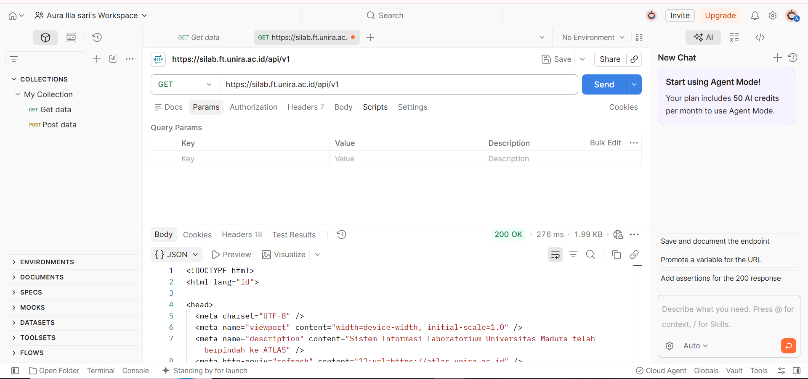
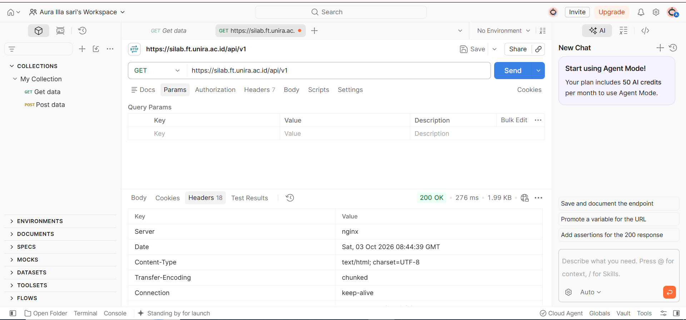
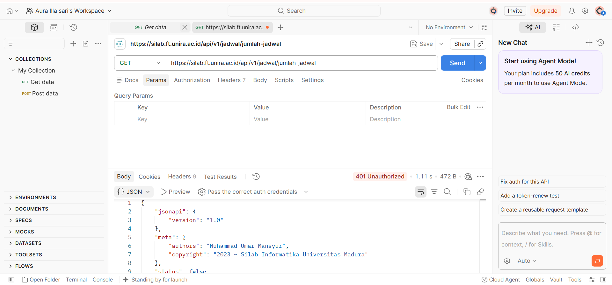
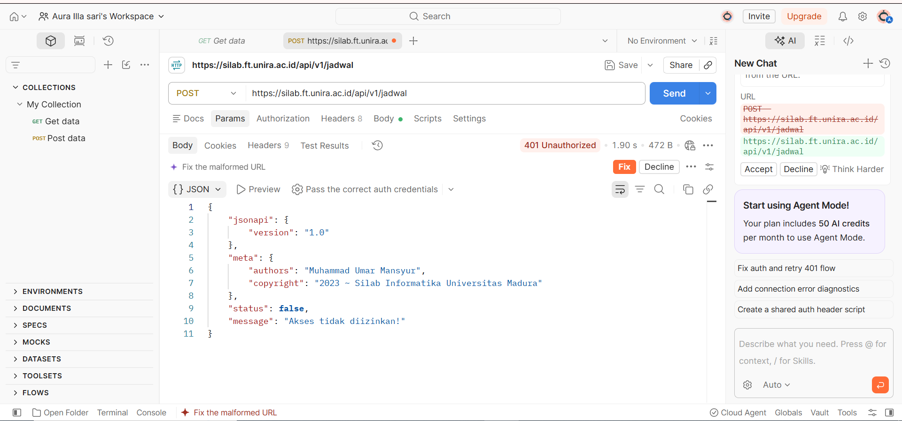
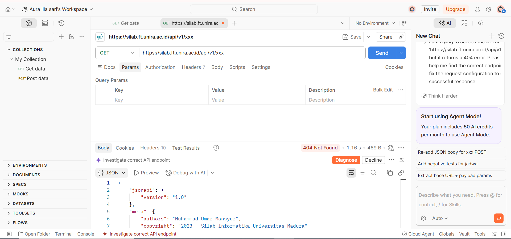
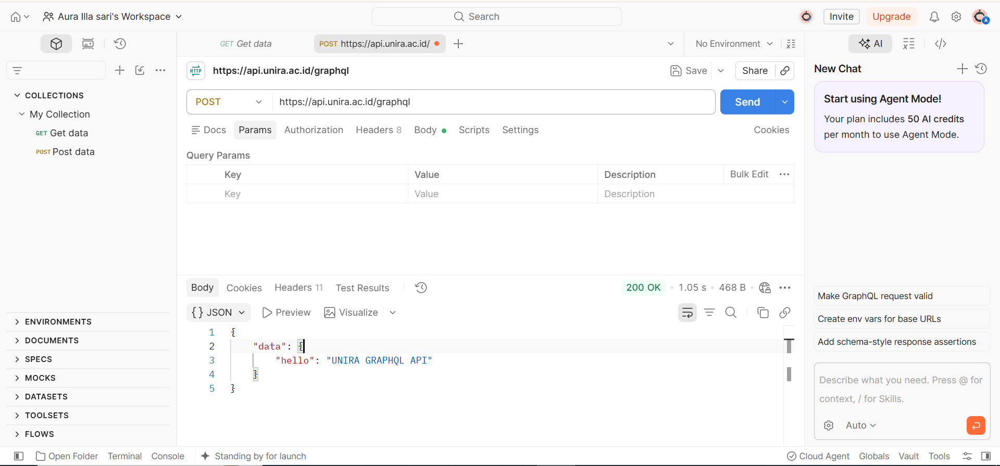

# TM-2 — Kartu HTTP Method + Code

## 1. GET `/api/v1`

- **Method:** GET
- **Endpoint:** `https://silab.ft.unira.ac.id/api/v1`
- **HTTP Code:** 200 OK
- **Status:** Berhasil
- **Message:** Response berupa halaman HTML dari API.
- **Siapa yang salah:** Tidak ada kesalahan karena request berhasil.
- **Aksi perbaikan:** Tidak diperlukan.

### Screenshot Response

### Screenshot Headers

---

## 2. GET `/jadwal/jumlah-jadwal`

- **Method:** GET
- **Endpoint:** `https://silab.ft.unira.ac.id/api/v1/jadwal/jumlah-jadwal`
- **HTTP Code:** 401 Unauthorized
- **Status:** Gagal
- **Message:** `Akses tidak diizinkan!`
- **Siapa yang salah:** Request tidak memiliki akses atau autentikasi yang diperlukan.
- **Aksi perbaikan:** Melakukan autentikasi terlebih dahulu dan menggunakan token atau credential yang sesuai.

### Screenshot

---

## 3. POST `/jadwal`

- **Method:** POST
- **Endpoint:** `https://silab.ft.unira.ac.id/api/v1/jadwal`
- **HTTP Code:** 401 Unauthorized
- **Status:** Gagal
- **Message:** `Akses tidak diizinkan!`
- **Siapa yang salah:** Request tidak memiliki akses atau autentikasi yang diperlukan.
- **Aksi perbaikan:** Melakukan autentikasi terlebih dahulu dan menggunakan token atau credential yang sesuai.

### Screenshot

---

## 4. GET `/xxx`

- **Method:** GET
- **Endpoint:** `https://silab.ft.unira.ac.id/api/v1/xxx`
- **HTTP Code:** 404 Not Found
- **Status:** Gagal
- **Message:** Endpoint tidak ditemukan.
- **Siapa yang salah:** URL atau endpoint yang digunakan tidak sesuai.
- **Aksi perbaikan:** Memeriksa kembali penulisan URL dan menggunakan endpoint yang benar.

### Screenshot

---

## 5. POST GraphQL

- **Method:** POST
- **Endpoint:** `https://api.unira.ac.id/graphql`
- **HTTP Code:** 200 OK
- **Status:** Berhasil
- **Message:** `UNIRA GRAPHQL API`
- **Siapa yang salah:** Tidak ada kesalahan karena request berhasil.
- **Aksi perbaikan:** Tidak diperlukan.

### Screenshot

---

## 6. Rekapitulasi HTTP Status Code

| Kategori | Hasil Pengujian | Keterangan |
|---|---|---|
| 200 | Ada | Request berhasil |
| 201 | Belum ditemukan | Belum ada endpoint yang menghasilkan 201 pada pengujian |
| 400 | Belum ditemukan | Belum ada endpoint yang menghasilkan 400 pada pengujian |
| 401–403 | Ada | Ditemukan status 401 Unauthorized |
| 500 | Belum ditemukan | Belum ada endpoint yang menghasilkan 500 pada pengujian |
| 404 | Ada | Endpoint `/xxx` tidak ditemukan |

---

## 7. Analisis

Berdasarkan pengujian menggunakan Postman, HTTP status code menunjukkan kondisi dari request yang dikirim ke server.

Status `200 OK` menunjukkan bahwa request berhasil diproses oleh server. Pada pengujian ini, status 200 ditemukan pada endpoint `/api/v1` dan GraphQL.

Status `401 Unauthorized` menunjukkan bahwa request tidak memiliki akses atau autentikasi yang sesuai. Status ini ditemukan pada endpoint `jadwal/jumlah-jadwal` dan `POST /jadwal`.

Status `404 Not Found` menunjukkan bahwa endpoint yang diminta tidak ditemukan. Status ini diperoleh ketika mengakses endpoint `/xxx`.

Untuk status `201 Created`, `400 Bad Request`, dan `500 Internal Server Error`, belum ditemukan pada endpoint yang diuji. Oleh karena itu, hasil tersebut tidak dibuat-buat.

---

## 8. Perbedaan `curl -s` dan `curl -i`

- `curl -s` atau silent mode digunakan untuk menampilkan response tanpa menampilkan progress atau informasi tambahan dari proses request.
- `curl -i` menampilkan HTTP response headers sekaligus response body.
- Perbedaan utamanya adalah `curl -i` berguna untuk melihat informasi seperti HTTP status code dan header response, sedangkan `curl -s` lebih bersih karena hanya menampilkan response.

---

## 9. Kesimpulan

Dari pengujian yang dilakukan menggunakan Postman dapat diketahui bahwa setiap HTTP status code memiliki arti dan tindakan perbaikan yang berbeda.

Status `200` menunjukkan request berhasil, `401` menunjukkan masalah autentikasi atau akses, sedangkan `404` menunjukkan endpoint tidak ditemukan.

Pengujian juga menunjukkan bahwa tidak semua kategori status code yang diminta dapat ditemukan pada endpoint yang tersedia untuk diuji. Oleh karena itu, status `201`, `400`, dan `500` dicatat sebagai belum ditemukan tanpa membuat hasil pengujian yang tidak dilakukan.

---

## 10. Export Postman

Hasil pengujian dilakukan menggunakan Postman dan dapat dilampirkan dalam bentuk export collection pribadi sebagai bukti pengujian.

