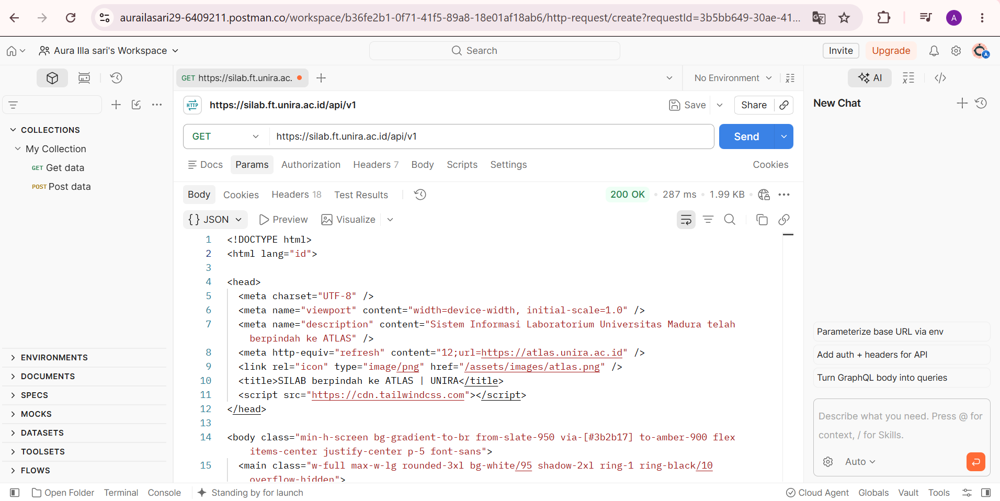
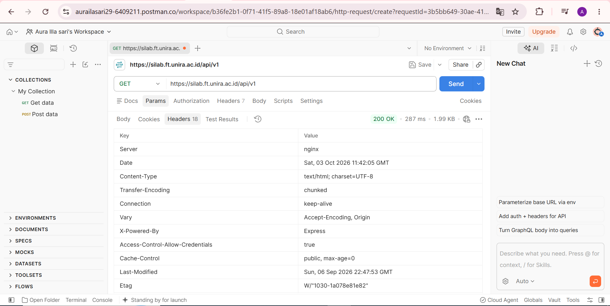
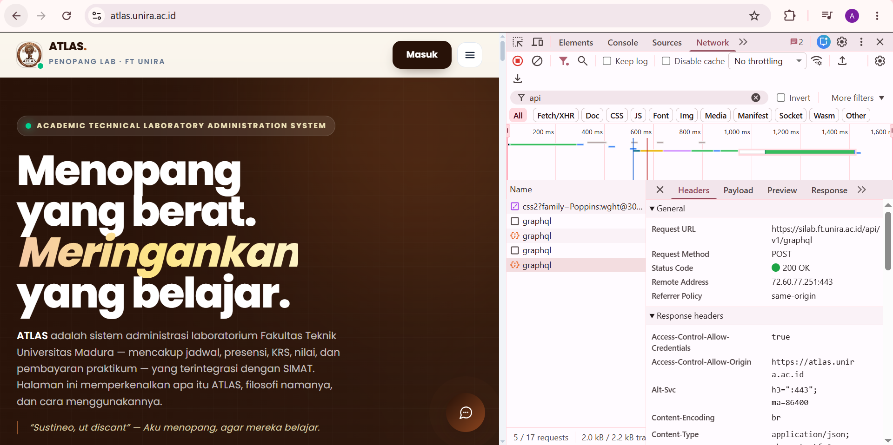
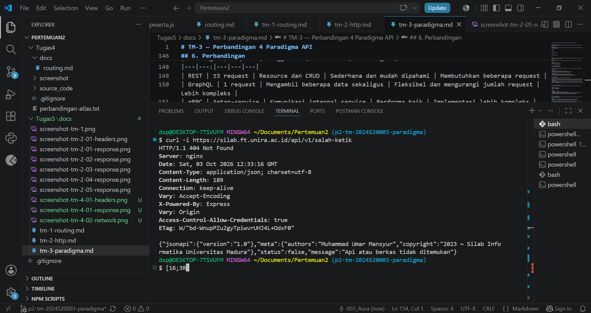

# TM-4 — HTTP Client + DevTools #

1. Postman — GET $BASE

Pengujian dilakukan menggunakan Postman dengan endpoint:
https://silab.ft.unira.ac.id/api/v1
Method: GET
HTTP Code: 200 OK
Status: Berhasil
Response: Halaman HTML dari API.
> Screenshot Response

> Screenshot Headers

2. DevTools Network
Pengujian dilakukan menggunakan DevTools Network pada halaman sistem yang saat ini telah menggunakan ATLAS.

Pada Network ditemukan request API:

https://silab.ft.unira.ac.id/api/v1/graphql

Hasil request:
Request Method: POST
Status Code: 200 OK
Request: /api/v1/graphql
> Screenshot Network

- Catatan: Sistem SILAB saat ini telah menggunakan ATLAS. Pada pengujian halaman tersebut tidak ditemukan request dengan nama /api/v1/jadwal. Request /api/v1/graphql merupakan request API yang ditemukan secara aktual pada DevTools Network.

3. Curl — Endpoint Salah

Pengujian dilakukan menggunakan perintah:
curl -i https://silab.ft.unira.ac.id/api/v1/salah-ketik
Hasil pengujian:
HTTP Code: 404 Not Found
Server: nginx
Content-Type: application/json
Message: Api atau berkas tidak ditemukan

- Hasil tersebut menunjukkan bahwa endpoint yang digunakan tidak ditemukan oleh server.
> Screenshot Curl

- Catatan: Instruksi tugas mencantumkan contoh header 500, tetapi hasil pengujian aktual pada endpoint /api/v1/salah-ketik menghasilkan 404 Not Found. Hasil dokumentasi mengikuti pengujian yang benar-benar dilakukan dan tidak mengubah status menjadi 500.

4. Perbedaan curl -s dan curl -i
curl -s atau silent mode digunakan untuk menjalankan request tanpa menampilkan progress atau informasi tambahan dari proses request.
curl -i menampilkan HTTP response headers sekaligus response body.
Perbedaan utamanya adalah curl -i dapat digunakan untuk melihat informasi seperti HTTP status code, server, dan content type, sedangkan curl -s menampilkan response dengan lebih bersih.

5. Rekapitulasi Hasil Pengujian
Pengujian	Method	Hasil
GET $BASE	GET	200 OK
DevTools /api/v1/graphql	POST	200 OK
/api/v1/salah-ketik	GET	404 Not Found

6. Kesimpulan

- Pengujian TM-4 dilakukan menggunakan Postman, DevTools Network, dan curl sebagai alat ukur untuk melihat hasil request secara langsung.

- Postman menunjukkan bahwa GET $BASE menghasilkan 200 OK. DevTools menunjukkan adanya request POST /api/v1/graphql dengan status 200 OK. Sementara itu, pengujian menggunakan curl -i pada endpoint yang salah menghasilkan 404 Not Found.